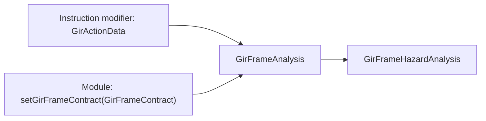
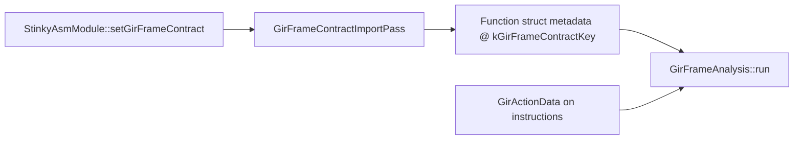

# GIR Frame Contract

## Status

This document describes the current implementation and is the reference for the
contract's fields. `include/stinkytofu/analysis/asm/GirFrameAnalysis.hpp` and
`include/stinkytofu/ir/asm/StinkyModifiers.hpp` are the declarations; anything
here that disagrees with them is a bug in this document.

The frame contract tells StinkyTofu which rotating buffer each shared-memory
access touches. It is the sole input to
[`GirFrameAnalysis` and the GIR frame passes](gir-frame-passes.md). Without a
contract those passes see an empty result and do nothing.

The contract carries **rotation facts only** — never instructions, never waits,
never barriers. It says "this `tensor_load_to_lds` writes operand `A`, region 0,
one generation ahead of the loop-carried phase, on a rotation of period 2". What
that implies for barriers and `s_wait_*cnt` is decided entirely inside
StinkyTofu.

Nothing in the contract appears in the generated `.s`. A change to what crosses
is therefore invisible to an assembly diff, which is why contract changes must be
gated on comparing generated assembly rather than on the contract alone.

## Two channels

Facts arrive by two routes, and which one carries what is a deliberate split.



**Per instruction** — a `GirActionData` modifier. Everything that is a fact
*about an instruction* rides on that instruction: its GIR identity and every
shared-memory touch it performs. This survives IR conversion, logical lowering,
CFG splitting and scheduling, because the fact moves with the instruction rather
than being held in a side table keyed by position.

**Per module** — `StinkyAsmModule::setGirFrameContract`, holding a
`std::shared_ptr<const GirFrameContract>`. Only what belongs to *no* single
instruction travels here: the generation table, the phi edges, the guard
constraints, and the fence relations.

Both are structs. Nothing is encoded, so there is no text format for a writer
and a reader to disagree about.

---

## Per-instruction data

### `GirActionKind`

`StinkyModifiers.hpp:1116`

```cpp
enum class GirActionKind : uint8_t { Other, Read, Copy, Fence, Wmma, WaitCnt };
```

| Value | Meaning |
| --- | --- |
| `Other` | Carries no GIR role |
| `Read` | Shared to register (`ds_read`) |
| `Copy` | Global to shared (`tensor_load_to_lds`, `ds_write`) |
| `Fence` | Orders other actions; owns barrier pieces |
| `Wmma` | Matrix multiply consuming read results |
| `WaitCnt` | A wait the producer already decided on |

`isGirFence(inst)` (`StinkyAsmIR.hpp:860`) tests `kind == Fence`.

### `GirActionData`

`StinkyModifiers.hpp:1136`. The instruction's GIR identity.

| Field | Type | Meaning |
| --- | --- | --- |
| `actionId` | `uint64_t` | Identity of the GIR action this instruction realizes. Several instructions may share one id when one action expands to many. |
| `anchorAction` | `uint64_t` | The action this one hangs from. Used to locate the physical block an action's edges attach to. |
| `kind` | `GirActionKind` | Role, above. |
| `accesses` | `vector<GirAccessData>` | Every shared-memory touch this instruction makes. Empty for an action that touches no LDS. |

### `GirAccessData`

`StinkyModifiers.hpp:1120`. One shared-memory touch. **All eight fields:**

| Field | Type | Default | Meaning |
| --- | --- | --- | --- |
| `isWrite` | `bool` | `false` | Write, else read. A read/read pair is never a hazard. |
| `operand` | `std::string` | `""` | Operand name: `A`, `B`, `MXSA`, `MXSB`, ... Part of the storage identity, compared by value. |
| `ring` | `int` | `1` | Period of the rotation this access participates in. `1` means it never rotates. |
| `genId` | `int` | `-1` | Which generation rotates it. **`-1` means not bound to a generation**, so the access is pinned or static. |
| `gdelta` | `int` | `0` | Offset from the loop-carried phase, in generations. |
| `absolute` | `int` | `-1` | A pinned phase. **`-1` means relative** — resolve through the frame instead. |
| `crossAgent` | `bool` | `false` | Whether agents other than this wave observe the access. This is what makes a hazard need a barrier rather than only a wait. |
| `region` | `int` | `-1` | The one storage region this touch selects. **`-1` names the whole operand**, so it meets every region of the same operand. |

---

## Module data

### `GirFrameContract`

`GirFrameAnalysis.hpp:87`. **All seven members:**

| Member | Type | Meaning |
| --- | --- | --- |
| `loaded` | `bool` | Whether a contract was supplied *at all*, as opposed to one that supplied no facts. Every `add*` call sets it. |
| `generations` | `map<int, GirGenerationSpec>` | The rotation table, keyed by generation id. |
| `actions` | `map<uint64_t, GirActionSpec>` | Action table, keyed by action id. |
| `accesses` | `vector<GirAccessSpec>` | Flat access list; `GirActionSpec::accesses` indexes into it. |
| `incomings` | `vector<GirFrameIncomingSpec>` | Per-edge phase assignments. |
| `relations` | `vector<GirFenceRelationSpec>` | Which fence discharges which hazard. |
| `requires_` | `vector<GirFrameRequiresSpec>` | Per-edge phase constraints. |

A caller may populate the members directly. `src/conversion/rocisa/ToStinkyTofuUtils.cpp`
additionally exposes three construction helpers — `addGeneration`, `addIncoming`
and `addRequires` — each of which appends one record and sets `loaded`. Note
those three cover only the generation table, the incomings and the guard
constraints: `actions`, `accesses` and `relations` reach the analysis by other
means, the first two on the instructions themselves.

### `GirGenerationSpec`

`GirFrameAnalysis.hpp:34`. One rotating buffer set. **All four fields:**

| Field | Type | Default | Meaning |
| --- | --- | --- | --- |
| `id` | `int` | `-1` | Identity of the rotation. |
| `ring` | `int` | `1` | Period: how many buffers it cycles through. |
| `entry` | `int` | `0` | Phase held on entry to the loop that rotates it. |
| `advance` | `int` | `0` | How far one trip of that loop advances the phase. `0` never rotates — a guard generation is one. |

The analysis requires every generation to map to exactly one loop; see
[Validation](#validation).

### `GirAccessSpec`

`GirFrameAnalysis.hpp:41`. The contract-table form of an access — the same facts
as `GirAccessData` plus the owning action, and with `absolute` spelled
`absoluteGeneration`. **All nine fields:**

| Field | Type | Default | Meaning |
| --- | --- | --- | --- |
| `actionId` | `uint64_t` | `0` | The action that performs this access. |
| `isWrite` | `bool` | `false` | Write, else read. |
| `genId` | `int` | `-1` | Generation, or `-1` for none. |
| `ring` | `int` | `1` | That generation's period. |
| `gdelta` | `int` | `0` | Offset from the loop-carried phase. |
| `absoluteGeneration` | `int` | `-1` | Pinned phase, or `-1` for relative. |
| `crossAgent` | `bool` | `false` | Observed by other agents. |
| `operand` | `std::string` | `""` | Operand name. |
| `region` | `int` | `-1` | Storage region, `-1` for the whole operand. |

### `GirActionSpec`

`GirFrameAnalysis.hpp:70`. **All four fields:**

| Field | Type | Default | Meaning |
| --- | --- | --- | --- |
| `id` | `uint64_t` | `0` | Action identity. |
| `anchorAction` | `uint64_t` | `0` | The action this one hangs from. |
| `kind` | `GirActionKind` | `Other` | Role. |
| `accesses` | `vector<size_t>` | `{}` | Indices into `GirFrameContract::accesses`. |

### `GirFrameIncomingSpec`

`GirFrameAnalysis.hpp:62`. What phase a generation takes on one edge. **All five
fields:**

| Field | Type | Default | Meaning |
| --- | --- | --- | --- |
| `destinationAction` | `uint64_t` | `0` | Action anchoring the edge's destination block. |
| `sourceAction` | `uint64_t` | `0` | Action anchoring the edge's source. |
| `genId` | `int` | `-1` | Which generation this states. |
| `value` | `int` | `0` | The phase, or the step when `relative`. |
| `relative` | `bool` | `false` | `false` — the edge **assigns** `value`. `true` — the edge **advances** the phase by `value`. |

### `GirFrameRequiresSpec`

`GirFrameAnalysis.hpp:80`. The mirror of `GirFrameIncomingSpec`: incoming
*assigns* a phase on an edge, this *constrains* one, so a guard generation can
refuse arms that cannot reach a successor. **Absence constrains nothing.** All
four fields:

| Field | Type | Default | Meaning |
| --- | --- | --- | --- |
| `destinationAction` | `uint64_t` | `0` | Edge destination anchor. |
| `sourceAction` | `uint64_t` | `0` | Edge source anchor. |
| `genId` | `int` | `-1` | Which generation is constrained. |
| `values` | `vector<int>` | `{}` | The edge is takeable only when `genId` holds one of these. |

### `GirFenceRelationSpec`

`GirFrameAnalysis.hpp:54`. Which fence discharges which hazard. **All five
fields:**

| Field | Type | Default | Meaning |
| --- | --- | --- | --- |
| `fenceAction` | `uint64_t` | `0` | The `Fence` action. |
| `kind` | `GirHazardKind` | `RAW` | Which hazard kind it discharges. |
| `producerAction` | `uint64_t` | `0` | Producer side. |
| `consumerAction` | `uint64_t` | `0` | Consumer side. |
| `gap` | `int` | `0` | Same-trip (`0`) or later-trip (non-zero). Matched on zero-ness, not on value. |

Relations are **not** used to place fences or derive waits. Their one consumer is
`addGirFenceEdges` (`src/transforms/asm/dag/RegionDAG.cpp:150`), which turns each
match into scheduling-order edges so a fence stays in its admissible window:
`fence` before `consumer` always, and `producer` before `fence` when
`gap == 0`. A loop-carried producer is a trip away and needs no edge of its own.

---

## Storage identity

An access names concrete storage only once a **frame** — an assignment of a phase
to every generation — is supplied:

```text
phase   = absoluteGeneration >= 0
          ? absoluteGeneration mod ring
          : (frame.phaseOf(genId) + gdelta) mod ring

storage = (operand, region, phase)
```

`concreteStorage` (`src/analysis/asm/GirFrameAnalysis.cpp:93`) interns that
triple into a dense integer id. **The triple is the whole identity**: two
accesses collide if and only if they agree on operand, region and phase. A
`region` of `-1` meets every region of the same operand
(`disjointRegions`, `:75`).

The pinned/relative split is structural rather than a flag to interpret: an
access at a compile-time known chunk carries `absoluteGeneration` and no
generation; a loop-carried access carries a generation and a `gdelta`.

## Frame and node types

| Type | Fields | Meaning |
| --- | --- | --- |
| `GirFrame` | `phases: vector<pair<int,int>>` | Phase per generation. `phaseOf(genId)`, `setPhase(genId, phase)`. Ordered by `phases`, so frames are comparable and hashable (`GirFrameHash`). |
| `GirFrameNode` | `block`, `frame`, `incomingAction` | A point in the frame graph. `incomingAction` records which action's edge entered, so one `(block, frame)` pair reached two ways stays two nodes. |
| `GirAccessOccurrence` | `inst`, `block`, `instructionIndex`, `accessIndex`, `frame`, `storage` | One dynamic touch: an access of an instruction, at a frame, resolved to a storage id. |

## Validation

`GirFrameAnalysis` refuses a malformed contract rather than degrading. Each is a
`report_fatal_error`:

| Condition | Message fragment |
| --- | --- |
| An incoming names a generation not in the table | `INCOMING names unknown generation` |
| An incoming names an action nothing realized | `INCOMING names unknown action` |
| An incoming's anchor has no instruction | `INCOMING action anchor has no physical realization` |
| Two incomings disagree on one physical block | `conflicting INCOMING values for physical block` |
| A generation's accesses tie across two loops | `generation maps ambiguously to ST loops` |
| A rotating generation maps to no loop | `rotating generation maps to no ST loop` |

The last is worth understanding. Generations are mapped to loops by majority vote
over the blocks their accesses live in. Dropping an unmapped generation silently
would leave its phase at 0 for the whole function, so every access would collapse
onto `gdelta % ring` and distinct buffers would alias onto one storage id. A
generation with `advance == 0` never rotates by construction, so only a rotating
one triggers the error.

## How the contract reaches a function



`GirFrameContractImportPass` (`src/transforms/asm/GirFrameContractImportPass.cpp`)
copies the module's `shared_ptr<const GirFrameContract>` onto each function as
struct metadata under `kGirFrameContractKey` (`"gir.frame_contract"`).
`GirFrameAnalysis::run` reads it back with
`function.getStructMetaData<GirFrameContract>(kGirFrameContractKey)` and returns
an empty result when it is absent or `loaded` is false.

The import pass refuses two states rather than proceeding:

| Condition | Message |
| --- | --- |
| GIR pipeline on, module carries no contract | `GIR frame pipeline enabled but the module carries no frame contract` |
| Contract present but no instruction carries an action tag | `GIR frame contract imported but rocisa conversion produced no action tags` |

The second is a genuine consistency check: a generation table with no tagged
instruction describes rotations nothing performs.

`generations`, `incomings`, `relations` and `requires_` arrive this way.
`actions` and `accesses` do **not** — `GirFrameAnalysis` builds those by
scanning every instruction's `GirActionData` modifier
(`src/analysis/asm/GirFrameAnalysis.cpp:330-344`), interning each
`GirAccessData` as a `GirAccessSpec` and recording its index on the owning
`GirActionSpec`.

## The text form — currently not wired up

`kGirFrameContractMarker` (`"gir-frame-contract"`) names a line-oriented
`tag [positional] key=value` form that appears in `.stir` tests as a module
metadata block:

```text
st.metadata "gir.frame_contract" {
gir-frame-contract

gen 0  ring=2 entry=0 advance=1
incoming  dst=1 src=0 gen=0 value=0
transfer  dst=1 src=1 gen=0 delta=1
}
```

**No parser for this block exists in the tree.** Nothing reads
`kGirFrameContractMarker`, and the five registered tests that depend on it —
`FileCheck.gir_frame_waitcnt_{fused_copy_group, guarded_prologue_join,
inflight_depth, loop_rotation, war_retire_depth}` — all fail: the block is
ignored, so `GirFrameAnalysis` is empty and the pass emits nothing. Treat the
syntax above as a record of intent, not as a supported input, until a parser
exists.

Note the `transfer` record has no struct counterpart of its own; the closest is
`GirFrameIncomingSpec` with `relative = true`, where `delta` would be `value`.
That correspondence is **unverified** — there is no code implementing it.

Instruction-level data is unaffected: `mod.gir_action` *is* parsed from `.stir`
(`src/serialization/asm/ModifierSerializer.cpp:708`), with per-access fields
spelled `access<N>_write`, `access<N>_operand`, `access<N>_ring`,
`access<N>_gen`, `access<N>_gdelta`, `access<N>_abs`.

The marker is an identifier, **not a version**. Producer and parser ship
together, so a mismatch is a build error rather than something to negotiate.

## Related documents

- [GIR Frame Passes and Analyses](gir-frame-passes.md) — what consumes this
- [Insert Cluster Barrier Pass](cluster-barrier.md) — the `-3` barriers
- [Architecture](architecture.md) — pass pipeline overview
