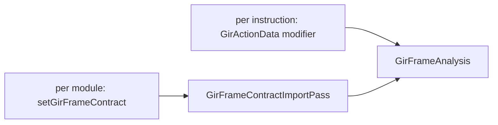

# GIR Frame Contract

## Status

This document describes the current implementation and is the reference for the
contract's fields. `include/stinkytofu/analysis/asm/GirFrameAnalysis.hpp` and
`include/stinkytofu/ir/asm/StinkyModifiers.hpp` are the declarations; anything
here that disagrees with them is a bug in this document.

The frame contract tells StinkyTofu which rotating buffer each shared-memory
access touches. It is the sole input to
[`GirFrameAnalysis` and the GIR frame passes](gir-frame-passes.md). Without one
those passes see an empty result and do nothing.

It carries **rotation facts only** — never instructions, never waits, never
barriers. It says "this `tensor_load_to_lds` writes operand `A`, region 0, one
generation ahead of the loop-carried phase, on a rotation of period 2". What
that implies for barriers and `s_wait_*cnt` is decided inside StinkyTofu.

Nothing in the contract appears in the generated `.s`, so a change to what
crosses is invisible to an assembly diff. Gate contract changes on comparing
generated assembly, not on the contract alone.

This document is in two parts:

| Part | Contents |
| --- | --- |
| [Set by the producer](#part-1--set-by-the-producer) | The input surface. Everything a frontend must supply. |
| [Built by the analysis](#part-2--built-by-the-analysis) | Internal structures derived from that input. Not settable. |

---

# Part 1 — Set by the producer

Two channels, and which one carries what is a deliberate split.



**Per instruction** — a `GirActionData` modifier. Every fact *about an
instruction* rides on it, and so survives IR conversion, logical lowering, CFG
splitting and scheduling.

**Per module** — `StinkyAsmModule::setGirFrameContract`, holding a
`std::shared_ptr<const GirFrameContract>`. Only what belongs to *no* single
instruction: the generation table, the phi edges, the guard constraints.

## 1.1 Per instruction

### `GirActionKind`

`StinkyModifiers.hpp:1116`

```cpp
enum class GirActionKind : uint8_t { Other, Read, Copy, Fence, Wmma, WaitCnt };
```

| Value | Meaning |
| --- | --- |
| `Other` | Carries no GIR role |
| `Read` | Shared to register (`ds_read`) |
| `Copy` | Global to shared (`tensor_load_to_lds`, `ds_write`) |
| `Fence` | Orders other actions; owns barrier pieces |
| `Wmma` | Matrix multiply consuming read results |
| `WaitCnt` | A wait the producer already decided on |

`isGirFence(inst)` (`StinkyAsmIR.hpp:860`) tests `kind == Fence`.

### `GirActionData`

`StinkyModifiers.hpp:1136`. **All four fields:**

| Field | Type | Default | Meaning |
| --- | --- | --- | --- |
| `actionId` | `uint64_t` | `0` | Identity of the GIR action this instruction realizes. Several instructions may share one id when one action expands to many. |
| `anchorAction` | `uint64_t` | `0` | The action this one hangs from; locates the physical block an action's edges attach to. |
| `kind` | `GirActionKind` | `Other` | Role, above. |
| `accesses` | `vector<GirAccessData>` | `{}` | Every shared-memory touch. Empty for an action touching no LDS. |

### `GirAccessData`

`StinkyModifiers.hpp:1120`. One shared-memory touch. **All eight fields:**

| Field | Type | Default | Meaning |
| --- | --- | --- | --- |
| `isWrite` | `bool` | `false` | Write, else read. A read/read pair is never a hazard. |
| `operand` | `std::string` | `""` | `A`, `B`, `MXSA`, `MXSB`, ... Part of the storage identity, compared by value. |
| `ring` | `int` | `1` | Period of the rotation. `1` never rotates. |
| `genId` | `int` | `-1` | Which generation rotates it. **`-1` = not bound to a generation.** |
| `gdelta` | `int` | `0` | Offset from the loop-carried phase, in generations. |
| `absolute` | `int` | `-1` | A pinned phase. **`-1` = relative**, resolve through the frame. |
| `crossAgent` | `bool` | `false` | Observed by agents other than this wave. This is what makes a hazard need a barrier rather than only a wait. |
| `region` | `int` | `-1` | The one storage region selected. **`-1` = the whole operand**, meeting every region of that operand. |

### Spelling in `.stir`

Parsed by `src/serialization/asm/ModifierSerializer.cpp:708`:

```text
{ mod.gir_action = { action = 1, anchor = 1, kind = copy,
                     access0_write = 1, access0_operand = A, access0_ring = 2,
                     access0_gen = 0, access0_gdelta = 1, access0_abs = 0 } }
```

`access<N>_` repeats per access. `kind` is the lowercased enumerator.

## 1.2 Per module

```cpp
contract.addGeneration(id, ring, entry);
contract.addIncoming(dst, src, gen, value, relative);
contract.addRequires(dst, src, gen, values);
module.setGirFrameContract(std::make_shared<const GirFrameContract>(contract));
```

Those three are the whole settable surface
(`src/conversion/rocisa/ToStinkyTofuUtils.cpp`); each also sets `loaded`. A
caller may equally populate the members directly.

### What the three records state

They describe the **producer's** control-flow graph, not StinkyTofu's. The
producer has blocks, phis and per-trip transfers; the contract restates those
facts in the one name that survives lowering.

| Record | What it states |
| --- | --- |
| `gen id ring entry` | A rotating buffer: how deep it is, and the phase it enters at. |
| `incoming dst src gen value` | A **phi input**: at producer block `dst`, generation `gen` receives `value` along the edge from producer block `src`. |
| `requires dst src gen values` | A **guard on that same edge**: it is takeable only when `gen` holds one of `values`. |

There is no frame-node id to key on, and there cannot be: the walk at
`:519-536` consults `incoming` and `requires` to decide each successor's phase,
and that phase is part of the node's identity. The frame graph is the result of
reading these records, so it cannot also be their subject.

### Anchors — how an edge names a block

`dst` and `src` are producer blocks written as **anchor actions**, because
producer blocks have no StinkyTofu identity.

`GirActionData::anchorAction` is that name. Every action **declares** the anchor
it hangs from; StinkyTofu never derives one. The actions sharing an anchor are
one producer block, and `anchorBlocks[anchor]` (`GirFrameAnalysis.cpp:352`) is
the set of `BasicBlock`s that producer block became. The anchor need not be an
action any instruction carries — an edge endpoint is valid if it is a realized
action **or** a named anchor (`:391`).

Two mappings, and only the second is one-to-one:

| Direction | Multiplicity | Cause |
| --- | --- | --- |
| producer block to `BasicBlock` | one to many | CFG splitting at labels, region cloning |
| anchor to producer block | one to one | the producer assigns it |

Because a `BasicBlock` may hold instructions from two producer blocks — nothing
splits them when no label intervenes — it is filed under **both** anchors, and
`blockAnchor` must still pick one. It takes the anchor of the **largest action
id** in that block (`:353-358`). That is the *outgoing* side: `advanceNode`
(`:496-500`) uses `blockAnchor` to answer "which producer block am I leaving",
and control leaving a merged block leaves the last one. The incoming side needs
no winner, which is why `anchorBlocks` keeps both.

Whether a merged block occurs in practice is unmeasured; the tie-break may be
defensive.

### `GirGenerationSpec` — from `addGeneration`

`GirFrameAnalysis.hpp:34`. One rotating buffer. **All three fields:**

| Field | Type | Default | Meaning |
| --- | --- | --- | --- |
| `id` | `int` | `-1` | Identity of the rotation. |
| `ring` | `int` | `1` | Period: how many buffers it cycles through. |
| `entry` | `int` | `0` | Phase held on entry to the loop that rotates it. |

There is no per-trip step. A **relative** `incoming` on the back edge is the only
statement of the rotation, and it is what `advanceFrame`'s back-edge branch used
to duplicate.

`entry` cannot move to an edge the same way. `advanceFrame` applies it on every
non-back edge into a loop header, including edges no `incoming` covers.

`ring` cannot either, though `GirAccessSpec::ring` carries the same number.
Taking it from the accesses changes 601 of 1116 mxf8 kernels. Overriding the
*value* in place is byte-identical, so the numbers agree; why sourcing it
elsewhere does not is unresolved. Treat `ring` as load-bearing.

### `GirFrameIncomingSpec` — from `addIncoming`

`GirFrameAnalysis.hpp:62`. What phase a generation takes on one edge. **All five
fields:**

| Field | Type | Default | Meaning |
| --- | --- | --- | --- |
| `destinationAction` | `uint64_t` | `0` | Action anchoring the edge's destination block. |
| `sourceAction` | `uint64_t` | `0` | Action anchoring the edge's source. |
| `genId` | `int` | `-1` | Which generation this states. |
| `value` | `int` | `0` | The phase, or the step when `relative`. |
| `relative` | `bool` | `false` | `false` — the edge **assigns** `value`. `true` — the edge **advances** the phase by `value`. |

A relative incoming on a back edge is what rotates a generation once per trip.
It is the only statement of that fact.

### `GirFrameRequiresSpec` — from `addRequires`

`GirFrameAnalysis.hpp:80`. The mirror of the above: incoming *assigns* a phase on
an edge, this *constrains* one, so a guard generation can refuse arms that cannot
reach a successor. **Absence constrains nothing.** All four fields:

| Field | Type | Default | Meaning |
| --- | --- | --- | --- |
| `destinationAction` | `uint64_t` | `0` | Edge destination anchor. |
| `sourceAction` | `uint64_t` | `0` | Edge source anchor. |
| `genId` | `int` | `-1` | Which generation is constrained. |
| `values` | `vector<int>` | `{}` | The edge is takeable only when `genId` holds one of these. |

### Spelling in `.stir` — currently not wired up

`kGirFrameContractMarker` (`"gir-frame-contract"`) names a line-oriented form
that `.stir` tests carry as a module metadata block:

```text
st.metadata "gir.frame_contract" {
gir-frame-contract

gen 0  entry=0
incoming  dst=1 src=0 gen=0 value=0
}
```

**No parser for this block exists.** Nothing reads `kGirFrameContractMarker`, and
the five registered tests depending on it —
`FileCheck.gir_frame_waitcnt_{fused_copy_group, guarded_prologue_join,
inflight_depth, loop_rotation, war_retire_depth}` — all fail: the block is
ignored, so the analysis is empty and the pass emits nothing. Treat the syntax as
a record of intent until a parser exists.

Instruction-level data is unaffected: `mod.gir_action` *is* parsed.

---

# Part 2 — Built by the analysis

None of this is settable. `GirFrameAnalysis::run` derives all of it.

## 2.1 Rebuilt from the instructions

`GirFrameContract::actions` and `::accesses` are **not** supplied by the module
channel. `GirFrameAnalysis` scans every instruction's `GirActionData`
(`src/analysis/asm/GirFrameAnalysis.cpp:330-344`), interning each `GirAccessData`
as a `GirAccessSpec` and recording its index on the owning `GirActionSpec`.
They are the contract-table mirror of Part 1.1, not a second input.

### `GirActionSpec`

`GirFrameAnalysis.hpp:70`. **All four fields:**

| Field | Type | Default | Meaning |
| --- | --- | --- | --- |
| `id` | `uint64_t` | `0` | Action identity. |
| `anchorAction` | `uint64_t` | `0` | The action this one hangs from. |
| `kind` | `GirActionKind` | `Other` | Role. |
| `accesses` | `vector<size_t>` | `{}` | Indices into `GirFrameContract::accesses`. |

### `GirAccessSpec`

`GirFrameAnalysis.hpp:41`. Same facts as `GirAccessData` plus the owning action,
with `absolute` spelled `absoluteGeneration`. **All nine fields:**

| Field | Type | Default | Meaning |
| --- | --- | --- | --- |
| `actionId` | `uint64_t` | `0` | The action performing this access. |
| `isWrite` | `bool` | `false` | Write, else read. |
| `genId` | `int` | `-1` | Generation, or `-1` for none. |
| `ring` | `int` | `1` | That generation's period. |
| `gdelta` | `int` | `0` | Offset from the loop-carried phase. |
| `absoluteGeneration` | `int` | `-1` | Pinned phase, or `-1` for relative. |
| `crossAgent` | `bool` | `false` | Observed by other agents. |
| `operand` | `std::string` | `""` | Operand name. |
| `region` | `int` | `-1` | Storage region, `-1` for the whole operand. |

### `GirFrameContract` — the assembled whole

`GirFrameAnalysis.hpp`. **All six members**, by origin:

| Member | Origin |
| --- | --- |
| `loaded` | set by any `add*`; false means no contract was supplied |
| `generations` | Part 1.2, `addGeneration` |
| `incomings` | Part 1.2, `addIncoming` |
| `requires_` | Part 1.2, `addRequires` |
| `actions` | **derived** from `GirActionData` |
| `accesses` | **derived** from `GirAccessData` |

## 2.2 Storage identity

An access names concrete storage only once a **frame** is supplied:

```text
phase   = absoluteGeneration >= 0
          ? absoluteGeneration mod ring
          : (frame.phaseOf(genId) + gdelta) mod ring

storage = (operand, region, phase)
```

`concreteStorage` (`GirFrameAnalysis.cpp:93`) interns that triple into a dense
id. **The triple is the whole identity**: two accesses collide if and only if
they agree on operand, region and phase. `region == -1` meets every region of the
same operand (`disjointRegions`, `:75`).

## 2.3 Frame graph structures

| Type | Members | Meaning |
| --- | --- | --- |
| `GirFrame` | `phases: vector<pair<int,int>>` | Phase per generation. `phaseOf`, `setPhase`. Ordered and hashable (`GirFrameHash`). |
| `GirFrameNode` | `block`, `frame`, `incomingAction` | A point in the frame graph. `incomingAction` keeps one `(block, frame)` reached two ways as two nodes. |
| `GirFrameEdges` | `entries`, `index` | Successors per node, iterated in **insertion** order; the fill walks blocks in program order. `operator[]`, `find`, `begin`/`end`, `size`. |
| `GirAccessOccurrence` | `inst`, `block`, `instructionIndex`, `accessIndex`, `frame`, `storage` | One dynamic touch resolved to a storage id. |

### `GirFrameAnalysis::Result`

| Member | Meaning |
| --- | --- |
| `contract` | The assembled contract, above |
| `actionInstructions` | actionId to every instruction realizing it |
| `blockFrames` | Every frame reachable at a block |
| `edges` | The frame graph |
| `occurrences` | Every `(instruction, access, frame)` with its storage id |
| `backEdges` | Latch-to-header edge keys |

`empty()` is `!contract.loaded`. State growth is bounded by `kMaxFrameStates`
(2^20).

## Validation

`GirFrameAnalysis` refuses a malformed contract rather than degrading:

| Condition | Message fragment |
| --- | --- |
| An incoming names a generation not in the table | `INCOMING names unknown generation` |
| An incoming names an action nothing realized | `INCOMING names unknown action` |
| An incoming's anchor has no instruction | `INCOMING action anchor has no physical realization` |
| Two incomings disagree on one physical block | `conflicting INCOMING values for physical block` |
| A generation's accesses tie across two loops | `generation maps ambiguously to ST loops` |
| A rotating generation maps to no loop | `rotating generation maps to no ST loop` |

`GirFrameContractImportPass` adds two more before the analysis runs: the pipeline
enabled with no contract, and a contract with no instruction carrying an action
tag. The second is a real consistency check — a generation table with no tagged
instruction describes rotations nothing performs.

The "maps to no loop" case matters because dropping an unmapped generation
silently would leave its phase at 0 for the whole function, collapsing every
access onto `gdelta % ring` and aliasing distinct buffers onto one storage id.

---

## Related documents

- [GIR Frame Passes and Analyses](gir-frame-passes.md) — what consumes this
- [Insert Cluster Barrier Pass](cluster-barrier.md) — the `-3` barriers
- [Architecture](architecture.md) — pass pipeline overview
