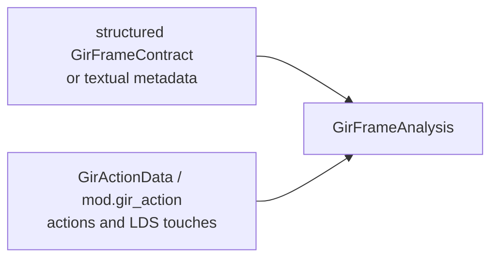

# GIR Frame Contract

## Purpose

This document is the complete reference for the GIR frame contract: its semantic
model, structured and textual representations, instruction annotations,
analysis lifecycle, derived frame graph, validation, and worked examples. The
source of truth is:

- `include/stinkytofu/analysis/asm/GirFrameAnalysis.hpp`
- `include/stinkytofu/ir/asm/StinkyModifiers.hpp`
- `parseGirFrameContract` in
  `src/analysis/asm/GirFrameAnalysis.cpp`
- the `mod.gir_action` reader in
  `src/serialization/asm/ModifierSerializer.cpp`

The frame contract tells StinkyTofu which rotating buffer each shared-memory
access touches. It is the sole input to
[`GirFrameAnalysis` and the GIR frame passes](gir-frame-passes.md). Without one
those passes see an empty result and do nothing.

It describes storage identity, phase rotation, and where existing instructions
touch that storage. It does not prescribe new waits or barriers. It can say
"this `tensor_load_to_lds` writes storage 0, one generation ahead of the
loop-carried phase, on a rotation of period 2"; the required ordering is decided
inside StinkyTofu.

Nothing in the contract is emitted as assembly text. Its effects appear
indirectly as dependency edges, barriers and waits. Verify a contract by running
the relevant passes and inspecting their output.

---

# Part 1 — Contract surface

The semantic contract combines module-scoped frame facts with
instruction-scoped action facts:



The module-scoped portion contains facts that do not belong to one instruction:
generation rings, edge assignments, and edge guards. It may be supplied as a
`GirFrameContract` object or as line-oriented `gir.frame_contract` text.

Each relevant instruction carries `mod.gir_action`, which names the action and
describes every LDS touch made by that instruction.

## 1.1 Contract composition and lifetime

The module-scoped portion contains:

- `loaded`: whether a contract is present
- `generations`: ring size and entry phase for each generation
- `incomings`: phase assignment or relative advance on a CFG edge
- `requires_`: phase constraints that make CFG edges feasible or infeasible

The instruction-scoped portion contains:

- stable action and anchor identities
- the action kind
- every logical LDS access made by that instruction

`GirFrameContractImportPass` copies a structured module contract to function
metadata. Textual metadata is parsed into the same structure. `GirFrameAnalysis`
then combines that module data with the `GirActionData` modifiers that survived
lowering. The resulting `actions` and `accesses` tables are analysis data, not a
second contract that must be kept in sync manually.

At function scope, structured metadata has precedence. If none is present,
`GirFrameAnalysis` falls back to `gir.frame_contract` string metadata and parses
it. Both routes produce the same `GirFrameContract` consumed by the analysis.

### Authoring checklist

1. Give every physical LDS region a stable `operand` id.
2. Decide whether each access is absolute (`accessN_abs`) or frame-relative
   (`accessN_gen` plus optional `accessN_gdelta`).
3. Give every tagged instruction an `action` id.
4. Give actions from the same logical CFG block the same `anchor`.
5. Add one `gen` record for every id used by a relative access.
6. Add `incoming` records where CFG edges assign or advance a phase.
7. Add `requires` records only when a phase makes an edge impossible.
8. Ensure the `.stir` CFG has explicit `Successors:` lists.
9. Run `stinkytofu-opt`, inspect the waits/barriers, and add FileCheck
   assertions for the required counts and positions.

## 1.2 Per-instruction action data

### `GirActionKind`

`StinkyModifiers.hpp:1116`

```cpp
enum class GirActionKind : uint8_t { Other, Read, Copy, Fence, Wmma, WaitCnt };
```

| Value | Meaning |
| --- | --- |
| `Other` | Carries no GIR role |
| `Read` | Shared to register (`ds_read`) |
| `Copy` | Global to shared (`tensor_load_to_lds`, `ds_write`) |
| `Fence` | Orders other actions; owns barrier pieces |
| `Wmma` | Matrix multiply consuming read results |
| `WaitCnt` | An already-existing wait represented as an action |

`isGirFence(inst)` (`StinkyAsmIR.hpp:860`) tests `kind == Fence`.

### `GirActionData`

`StinkyModifiers.hpp:1136`. **All four fields:**

| Field | Type | Default | Meaning |
| --- | --- | --- | --- |
| `actionId` | `uint64_t` | `0` | Identity of the GIR action this instruction realizes. Several instructions may share one id when one action expands to many. |
| `anchorAction` | `uint64_t` | `0` | The action this one hangs from; locates the physical block an action's edges attach to. |
| `kind` | `GirActionKind` | `Other` | Role, above. |
| `accesses` | `vector<GirAccessData>` | `{}` | Every shared-memory touch. Empty for an action touching no LDS. |

### `GirAccessData`

`StinkyModifiers.hpp:1120`. One shared-memory touch. **All seven fields:**

| Field | Type | Default | Meaning |
| --- | --- | --- | --- |
| `isWrite` | `bool` | `false` | Write, else read. A read/read pair is never a hazard. |
| `operand` | `int` | `-1` | The logical storage id. Assign one id per physical `(operand, region)` pair. Compared only for equality: equal ids can alias; different ids cannot. |
| `ring` | `int` | `1` | Period of the rotation. `1` never rotates. |
| `genId` | `int` | `-1` | Which generation rotates it. **`-1` = not bound to a generation.** |
| `gdelta` | `int` | `0` | Offset from the loop-carried phase, in generations. |
| `absolute` | `int` | `-1` | A pinned phase. **`-1` = relative**, resolve through the frame. |
| `crossAgent` | `bool` | `false` | Observed by agents other than this wave. This is what makes a hazard need a barrier rather than only a wait. |

### Spelling in `.stir`

Parsed by `src/serialization/asm/ModifierSerializer.cpp:708`:

```text
{ mod.gir_action = { action = 1, anchor = 1, kind = copy,
                     access0_write = 1, access0_operand = 0, access0_ring = 2,
                     access0_gen = 0, access0_gdelta = 1,
                     access0_cross = 1 } }
```

The reader applies these rules:

- `anchor` defaults to `action`.
- `kind` defaults to `other`.
- Access indices must be contiguous from zero. Parsing stops at the first
  missing `access<N>_operand`.
- `access<N>_operand` is the presence key for an access.
- `write` defaults to `0`, `ring` to `1`, `gen` to `-1`, `gdelta` to `0`,
  `abs` to `-1`, and `cross` to `0`.
- If `abs >= 0`, the access is absolute and `gen`/`gdelta` do not select its
  phase.
- If `abs < 0`, `gen` must name a declared generation.
- A `read` action contributes accesses only on a DS-read instruction.
- A `copy` action contributes accesses only on `tensor_load_to_lds` or a
  DS-write instruction.

Do not leave gaps such as `access0_`, `access2_`: `access2_` will not be read.
Kind names are exact lowercase strings; an unknown name becomes `other`.

Reuse an action id only when several physical instructions deliberately realize
the same action. The first occurrence defines that action's kind and access
list; later occurrences with the same id do not append more accesses.

## 1.3 Module-scoped frame data

### Structured representation

The native representation is `GirFrameContract`. A module owns an immutable
shared instance, and `GirFrameContractImportPass` installs it on each function
that the frame pipeline analyzes:

```cpp
GirFrameContract contract;
contract.loaded = true;
contract.generations.emplace(0, GirGenerationSpec{0, 2, 0});
contract.incomings.push_back(GirFrameIncomingSpec{
    .destinationAction = 20,
    .sourceAction = 10,
    .genId = 0,
    .value = 0,
    .relative = false,
});

module.setGirFrameContract(
    std::make_shared<const GirFrameContract>(std::move(contract)));
```

The structured module contract normally supplies `loaded`, `generations`,
`incomings`, and `requires_`. Instruction modifiers supply the action and access
facts that `GirFrameAnalysis` assembles into `actions` and `accesses`.

### Textual representation

Textual metadata represents the same module-scoped fields in `.stir` and other
serialized IR:

```text
st.metadata "gir.frame_contract" {
gir-frame-contract

gen 0  ring=2 entry=0
incoming  dst=20 src=10 gen=0 value=0
incoming  dst=20 src=20 gen=0 value=1 relative=1
requires  dst=30 src=20 gen=0 values=0,1
}
```

The first non-comment record must be the exact marker
`gir-frame-contract`. Empty lines and lines whose first non-space character is
`#` are ignored. Do not use trailing comments on records.

Only three record tags are accepted:

| Record | Required spelling | Meaning |
| --- | --- | --- |
| Generation | `gen ID ring=R entry=E` | Declare generation `ID`, its rotation period, and its phase on a non-backedge entry into the mapped loop. |
| Edge assignment | `incoming dst=DST src=SRC gen=G value=V [relative=1]` | On edge `SRC -> DST`, assign phase `V`, or add `V` modulo the ring when relative. |
| Edge guard | `requires dst=DST src=SRC gen=G values=V0,V1,...` | Permit edge `SRC -> DST` only for the listed phases. |

`ring` must be positive. `incoming` values are normalized modulo the generation
ring. Write `requires` values in canonical range `0 <= value < ring`; its parser
does not normalize them.

Both representations are module-scoped. Keep action, anchor, and generation ids
unique across functions that share one contract unless they intentionally
describe the same identity.

### Anchors name CFG endpoints

`incoming` and `requires` do not use `.stir` labels. Their `src` and `dst`
fields are **anchor ids** from `mod.gir_action`.

Use one anchor id for every logical CFG block represented by the contract:

```text
^left:
  "st.s_nop"(0) {
    mod.gir_action = { action = 10, anchor = 10, kind = other }
  }
  "st.s_branch"("join")
  Successors: ^join

^join:
  v[0:1] = "st.ds_load_b64"(v10) {
    mod.gir_action = { action = 21, anchor = 20, kind = read,
                       access0_operand = 0, access0_ring = 2,
                       access0_gen = 0 }
  }
```

Here action `21` belongs to anchor block `20`. An edge entering this block uses
`dst=20`, not `dst=21`. Several actions may share anchor `20`.

An anchor can survive block splitting: all physical blocks containing actions
with that anchor belong to the same logical group. When one physical block
contains actions from multiple anchors, the action with the largest action id
selects the outgoing anchor. Avoid relying on that tie-break in hand-written
tests; split the blocks explicitly instead.

### Generation records

`gen ID ring=R entry=E` declares a rotating phase:

- `ID` is referenced by `access<N>_gen`, `incoming gen=`, and
  `requires gen=`.
- `R` is the number of physical slots. Use the same ring on every access bound
  to this generation.
- `E` is installed on every non-backedge entry into the loop mapped to this
  generation.

The record does not say how much the phase changes per trip. Put that on the
backedge as a relative incoming:

```text
gen 0 ring=2 entry=0
incoming dst=20 src=10 gen=0 value=0
incoming dst=20 src=20 gen=0 value=1 relative=1
```

The first edge enters loop anchor `20` at phase 0. The second is the loop
backedge and advances the phase by one modulo 2.

### Incoming records

An incoming is selected by the outgoing anchor of the predecessor and the
destination anchor:

```text
incoming dst=30 src=10 gen=0 value=0
incoming dst=30 src=20 gen=0 value=1
```

This is a frame phi at anchor `30`: the phase is 0 when reached from anchor 10
and 1 when reached from anchor 20.

With `relative=1`, `value` is added to the predecessor's phase. Without it,
`value` replaces that phase. Use relative form for rotation; use absolute form
for a known phase delivered by a prologue, drain, or branch arm.

### Requires records

`requires` filters impossible frame-graph edges. It does not assign a phase:

```text
requires dst=30 src=10 gen=1 values=0
requires dst=30 src=20 gen=1 values=1
```

This says that anchor 10 can reach anchor 30 only when guard generation 1 is 0,
while anchor 20 can reach it only when the guard is 1. Multiple values use a
comma-separated list without spaces: `values=0,1`.

If no matching `requires` exists, the edge is unconstrained. Add these records
only for real control-flow correlation; unnecessary guards can remove valid
paths from the frame graph.

---

# Part 2 — Examples and manual authoring

The examples use the textual `.stir` representation because it shows the
module data, CFG, actions, and accesses in one place. The frame and storage
semantics are identical when the module-scoped portion is supplied as a
structured `GirFrameContract`.

## 2.1 Absolute storage: the smallest complete contract

Use absolute phases when the example is straight-line and no loop rotation is
needed. The marker line still matters even when there are no `gen` records.

```text
st.metadata "gir.frame_contract" {
gir-frame-contract
}

st.func @absolute_raw() {
^entry:
  "st.tensor_load_to_lds"(s[0:3], s[8:15]) {
    mod.gir_action = {
      action = 0, anchor = 0, kind = copy,
      access0_write = 1, access0_operand = 0,
      access0_ring = 2, access0_abs = 0, access0_cross = 1
    }
  }
  v[0:1] = "st.ds_load_b64"(v10) {
    mod.ds = { na = 1, offset = 0, gds = false },
    mod.gir_action = {
      action = 1, anchor = 0, kind = read,
      access0_write = 0, access0_operand = 0,
      access0_ring = 2, access0_abs = 0, access0_cross = 1
    }
  }
}
```

Both accesses resolve to storage `(operand=0, phase=0)`, so they form a RAW
pair. `cross=1` marks the storage as visible across waves; a workgroup barrier
is needed only when the function configuration actually has multiple waves.

Changing the read to `access0_abs = 1` makes the pair disjoint. Changing only
its `operand` also makes it disjoint.

## 2.2 One instruction touching several LDS regions

One instruction can carry any number of accesses. This is useful when one copy
instruction updates several logical regions:

```text
"st.tensor_load_to_lds"(s[0:3], s[8:15]) {
  mod.gir_action = {
    action = 10, anchor = 10, kind = copy,
    access0_write = 1, access0_operand = 0,
    access0_ring = 2, access0_abs = 0,
    access1_write = 1, access1_operand = 1,
    access1_ring = 2, access1_abs = 0,
    access2_write = 1, access2_operand = 2,
    access2_ring = 2, access2_abs = 0
  }
}
```

A read of operand 1 depends on this instruction; a read of operand 3 does not.
The three accesses share one counter issue because they belong to one physical
instruction.

## 2.3 Ring-2 loop rotation

This example has one prologue copy and a loop that rotates a double buffer:

```text
st.metadata "gir.frame_contract" {
gir-frame-contract

gen 300 ring=2 entry=0
incoming dst=301 src=300 gen=300 value=0
incoming dst=301 src=301 gen=300 value=1 relative=1
}

st.func @ring_two_loop() {
^entry:
  "st.tensor_load_to_lds"(s[0:3], s[10:17]) {
    mod.gir_action = {
      action = 300, anchor = 300, kind = copy,
      access0_write = 1, access0_operand = 0,
      access0_ring = 2, access0_abs = 0
    }
  }
  "st.s_branch"("loop")
  Successors: ^loop

^loop:
  "st.tensor_load_to_lds"(s[4:7], s[10:17]) {
    mod.gir_action = {
      action = 301, anchor = 301, kind = copy,
      access0_write = 1, access0_operand = 0,
      access0_ring = 2, access0_gen = 300
    }
  }
  v[0:1] = "st.ds_load_b64"(v10) {
    mod.ds = { na = 1, offset = 0, gds = false },
    mod.gir_action = {
      action = 302, anchor = 301, kind = read,
      access0_write = 0, access0_operand = 0,
      access0_ring = 2, access0_gen = 300,
      access0_gdelta = 1
    }
  }
  "st.s_cbranch_scc1"("loop", SCC0)
  Successors: ^loop, ^exit

^exit:
}
```

The frame calculation is:

```text
copy phase = frame[300]
read phase = (frame[300] + 1) mod 2
```

On the backedge, `frame[300]` advances by one. For a ring of two, adding one
selects the other slot, which is the previous trip's slot in steady state.

Important details:

- The non-relative incoming states what the entry edge delivers.
- The relative incoming states the backedge rotation.
- `anchor=301` groups the loop copy and read into one logical block.
- The access ring and generation ring are both 2.

## 2.4 Diamond join with explicit incoming phases

Each predecessor of a join may deliver a different phase. Name every arm:

```text
st.metadata "gir.frame_contract" {
gir-frame-contract

gen 100 ring=2 entry=0
incoming dst=102 src=100 gen=100 value=0
incoming dst=102 src=101 gen=100 value=1
}

st.func @diamond_join() {
^entry:
  "st.s_cbranch_scc1"("right", SCC0)
  Successors: ^left, ^right

^left:
  "st.tensor_load_to_lds"(s[0:3], s[10:17]) {
    mod.gir_action = {
      action = 100, anchor = 100, kind = copy,
      access0_write = 1, access0_operand = 0,
      access0_ring = 2, access0_gen = 100
    }
  }
  "st.s_branch"("join")
  Successors: ^join

^right:
  "st.s_nop"(0) {
    mod.gir_action = { action = 101, anchor = 101, kind = other }
  }
  "st.s_branch"("join")
  Successors: ^join

^join:
  v[0:1] = "st.ds_load_b64"(v10) {
    mod.ds = { na = 1, offset = 0, gds = false },
    mod.gir_action = {
      action = 102, anchor = 102, kind = read,
      access0_write = 0, access0_operand = 0,
      access0_ring = 2, access0_gen = 100
    }
  }
}
```

The left edge reaches the join at phase 0; the right edge reaches it at phase 1.
Consequently, the join read names different physical storage on the two paths.
This prevents the analysis from inventing a dependency on a copy that did not
run.

## 2.5 Computing storage by hand

For each access:

```text
if accessN_abs >= 0:
    phase = accessN_abs mod accessN_ring
else:
    phase = (frame[accessN_gen] + accessN_gdelta) mod accessN_ring

storage = (accessN_operand, phase)
```

Normalize negative arithmetic into `[0, ring)`. Two accesses can form a hazard
only when their storage pairs are equal and at least one is a write:

- write then read: RAW
- read then write: WAR
- write then write: WAW
- read then read: no hazard

`cross=1` does not change storage identity. It changes whether a multi-wave
hazard requires workgroup publication. A hazard is cross-agent when the
function has multiple waves and either endpoint carries `cross=1`; tagging all
accesses to the shared region is the clearest convention.

## 2.6 Verification workflow

The checked-in wait-count fixture uses:

```text
stinkytofu-opt --arch gfx1250 example.stir \
  --GirWaitCntInsertionPass --print-output
```

Verify all of the following:

1. The metadata parses without a `gir.frame_contract line N` error.
2. Every relative access names a declared generation.
3. The expected copy/read pair resolves to the same `(operand, phase)`.
4. A wait appears before the intended consumer or fence.
5. The wait immediate preserves the intended in-flight depth; do not check only
   for the presence of a wait.
6. An impossible branch arm does not create a wait.
7. Re-running the command produces identical output.

For a regression test, check the exact wait count and its neighboring
instructions with `CHECK-NEXT`. See
`tests/filecheck/gir_frame_waitcnt.stir` for complete examples.

## 2.7 Common contract mistakes

- Omitting the `gir-frame-contract` marker.
- Writing `gen 0 entry=0` without the required `ring=`.
- Using a relative access without `accessN_gen`.
- Giving an access a different ring from its generation.
- Reusing one operand id for physically different LDS regions.
- Giving the same physical region different operand ids on its writer and
  reader.
- Leaving an access-number gap.
- Misspelling `kind`; an unknown value is read as `other`.
- Reusing an action id with a different access list.
- Tagging a DS read as `copy`, or a tensor/DS write as `read`.
- Pointing `incoming src=` or `dst=` at an action id instead of the block's
  anchor id.
- Forgetting an incoming for one predecessor of a phase-changing join.
- Forgetting the relative incoming on a rotating backedge.
- Adding `requires` for an edge that is actually feasible.
- Reusing ids accidentally in another function covered by the same metadata.
- Omitting `.stir` `Successors:` lists, so the frame graph does not match the
  intended CFG.

---

# Part 3 — Built by the analysis

None of this is settable. `GirFrameAnalysis::run` derives all of it.

## 3.1 Rebuilt from the instructions

`GirFrameContract::actions` and `::accesses` are not records in the metadata
block. `GirFrameAnalysis` scans every instruction's `GirActionData`, interns
each `GirAccessData` as a `GirAccessSpec`, and records its index on the owning
`GirActionSpec`. They are the analysis representation of Part 1.2.

### `GirActionSpec`

`GirFrameAnalysis.hpp:70`. **All four fields:**

| Field | Type | Default | Meaning |
| --- | --- | --- | --- |
| `id` | `uint64_t` | `0` | Action identity. |
| `anchorAction` | `uint64_t` | `0` | The action this one hangs from. |
| `kind` | `GirActionKind` | `Other` | Role. |
| `accesses` | `vector<size_t>` | `{}` | Indices into `GirFrameContract::accesses`. |

### `GirAccessSpec`

`GirFrameAnalysis.hpp:41`. Same facts as `GirAccessData` plus the owning action,
with `absolute` spelled `absoluteGeneration`. **All nine fields:**

| Field | Type | Default | Meaning |
| --- | --- | --- | --- |
| `actionId` | `uint64_t` | `0` | The action performing this access. |
| `isWrite` | `bool` | `false` | Write, else read. |
| `genId` | `int` | `-1` | Generation, or `-1` for none. |
| `ring` | `int` | `1` | That generation's period. |
| `gdelta` | `int` | `0` | Offset from the loop-carried phase. |
| `absoluteGeneration` | `int` | `-1` | Pinned phase, or `-1` for relative. |
| `crossAgent` | `bool` | `false` | Observed by other agents. |
| `operand` | `int` | `-1` | The `(operand, region)` id the touch names. |

### `GirFrameContract` — the assembled whole

`GirFrameAnalysis.hpp`. **All six members**, by origin:

| Member | Origin |
| --- | --- |
| `loaded` | explicitly true in the structured form, or set by successful text parsing |
| `generations` | Part 1.3 `gen` records |
| `incomings` | Part 1.3 `incoming` records |
| `requires_` | Part 1.3 `requires` records |
| `actions` | **derived** from `GirActionData` |
| `accesses` | **derived** from `GirAccessData` |

## 3.2 Storage identity

An access names concrete storage only once a **frame** is supplied:

```text
phase   = absoluteGeneration >= 0
          ? absoluteGeneration mod ring
          : (frame.phaseOf(genId) + gdelta) mod ring

storage = (operand, phase)
```

`concreteStorage` interns that pair into a dense id.
**The pair is the whole identity**: two accesses collide if and only if they
agree on operand id and phase. Represent each independently addressed region
with its own operand id.

## 3.3 Frame graph structures

| Type | Members | Meaning |
| --- | --- | --- |
| `GirFrame` | `phases: vector<pair<int,int>>` | Phase per generation. `phaseOf`, `setPhase`. Ordered and hashable (`GirFrameHash`). |
| `GirFrameNode` | `block`, `frame`, `incomingAction` | A point in the frame graph. `incomingAction` keeps one `(block, frame)` reached two ways as two nodes. |
| `GirFrameEdges` | `entries`, `index` | Successors per node, iterated in **insertion** order; the fill walks blocks in program order. `operator[]`, `find`, `begin`/`end`, `size`. |
| `GirAccessOccurrence` | `inst`, `block`, `instructionIndex`, `accessIndex`, `frame`, `storage` | One dynamic touch resolved to a storage id. |

### `GirFrameAnalysis::Result`

| Member | Meaning |
| --- | --- |
| `contract` | The assembled contract, above |
| `actionInstructions` | actionId to every instruction realizing it |
| `blockFrames` | Every frame reachable at a block |
| `edges` | The frame graph |
| `occurrences` | Every `(instruction, access, frame)` with its storage id |
| `backEdges` | Latch-to-header edge keys |

`empty()` is `!contract.loaded`. State growth is bounded by `kMaxFrameStates`
(2^20).

## 3.4 Consumers and observable effects

The contract itself emits nothing. Its derived analyses drive several later
decisions:

1. `GirFrameAnalysis` resolves each access into dynamic occurrences over the
   finite frame graph.
2. `GirFrameHazardAnalysis` compares concrete storage and emits RAW, WAR, and
   WAW hazards with frame distance and cross-agent status.
3. `StinkyDAGSchedulerPass` adds same-trip (`gap == 0`) hazard edges when both
   endpoints are in one scheduling region. It also keeps the pieces of an
   existing GIR fence in order.
4. `GirFencePlacementPass` places workgroup barriers for cross-agent hazards.
5. `GirWaitCntInsertionPass` derives graded tensor and DS waits from the same
   frame spans.

This separation is important when debugging output:

- An unexpected instruction order can come from a same-trip DAG edge.
- A new `s_barrier_signal`/`s_barrier_wait` pair comes from fence placement,
  not from the ready-queue priority rule.
- A changed `s_wait_tensorcnt` or `s_wait_dscnt` immediate comes from counter
  flow, even when its anchor is a barrier.

See [GIR Frame Passes and Analyses](gir-frame-passes.md) for the algorithms
behind these consumers.

## 3.5 Validation

The text parser reports the metadata line number for syntax errors. It rejects:

- a record before `gir-frame-contract`
- a missing marker
- an unknown record tag
- a `gen` without exactly one positional id, `ring=`, or `entry=`
- a non-positive generation ring
- an `incoming` missing `dst=`, `src=`, `gen=`, or `value=`
- a `requires` missing `dst=`, `src=`, `gen=`, or `values=`
- a non-integer `requires values=` list

`GirFrameAnalysis` refuses a malformed contract rather than degrading:

| Condition | Message fragment |
| --- | --- |
| An access ring is not positive | `access ring must be positive` |
| A relative access has no generation id | `relative shared access has no generation` |
| An incoming names a generation not in the table | `INCOMING names unknown generation` |
| An incoming names an action nothing realized | `INCOMING names unknown action` |
| An incoming's anchor has no instruction | `INCOMING action anchor has no physical realization` |
| Two incomings disagree on one physical block | `conflicting INCOMING values for physical block` |
| A generation's accesses tie across two loops | `generation maps ambiguously to ST loops` |
| A rotating generation maps to no loop | `rotating generation maps to no ST loop` |

The structured import stage also rejects enabling the frame pipeline without a
module contract, and importing a contract when no instruction action tags
survived conversion.

The "maps to no loop" case matters because dropping an unmapped generation
silently would leave its phase at 0 for the whole function, collapsing every
access onto `gdelta % ring` and aliasing distinct buffers onto one storage id.

---

## Related documents

- [GIR Frame Passes and Analyses](gir-frame-passes.md) — what consumes this
- [Architecture](architecture.md) — pass pipeline overview
