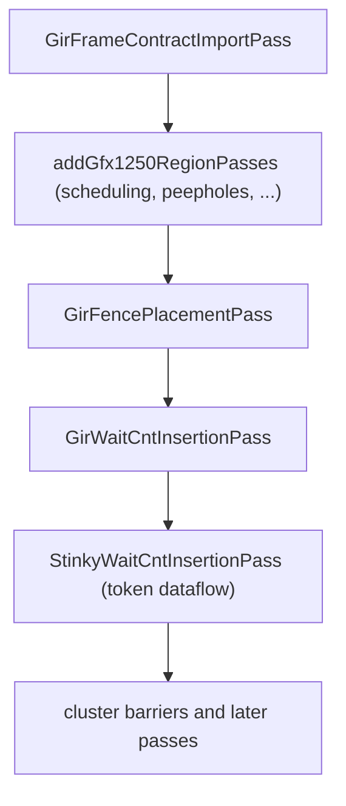

# GIR Frame Passes and Analyses

## Status

This document describes the current implementation.

Two analyses and two passes turn the [GIR frame contract](gir-frame-contract.md)
into barriers and wait counts. StinkyTofu owns both the placement of workgroup
barriers and the `s_wait_*cnt` that discharge cross-agent LDS hazards; the
contract supplies only rotation facts.

| Component | File |
| --- | --- |
| `GirFrameContractImportPass` | `src/transforms/asm/GirFrameContractImportPass.cpp` |
| `GirFrameAnalysis` | `src/analysis/asm/GirFrameAnalysis.cpp` |
| `GirFrameHazardAnalysis` | same file, `GirFrameHazardAnalysis::run` |
| `GirFencePlacementPass` | `src/transforms/asm/GirFencePlacementPass.cpp` |
| `GirWaitCntInsertionPass` | `src/transforms/asm/GirWaitCntInsertionPass.cpp` |
| Counter flow (the wait solver) | `src/transforms/asm/waitcnt/GirFrameCounterFlow.cpp` |

```cpp
STINKYTOFU_EXPORT std::unique_ptr<Pass> createGirFencePlacementPass();
STINKYTOFU_EXPORT std::unique_ptr<Pass> createGirWaitCntInsertionPass();
```

## Pipeline Position



`GirFrameContractImportPass` runs first and only moves data: it copies the
module's contract onto each function as struct metadata, and fails loudly if the
pipeline is enabled with no contract or with no instruction carrying an action
tag. See [How the contract reaches a function](gir-frame-contract.md#how-the-contract-reaches-a-function).

Placement runs **before** wait insertion. The order matters and is not
arbitrary: the wait a fence carries is a residual measured at wherever the fence
ends up standing, so the barrier has to exist before its count can be derived.

Neither pass is gated on the scheduler. `GirFencePlacementPass` is now the only
source of workgroup barriers on this path, and the wait pass anchors on them at
every optimisation level.

### Enabling

`Gfx1250Backend.cpp` runs both only when all three `ModuleOptions` hold:

```cpp
moduleOptions.EnableWaitCntInsertion &&
moduleOptions.EnableGirFramePipeline &&
moduleOptions.EnableGirFrameWaitCntInsertion
```

A module with the GIR options off never runs either pass, and no contract is
consulted. That is the control arm to reach for when deciding whether a
behaviour belongs to this path or to something shared with every other module.

Independently of the options, both passes return `PreservedAnalyses::all()`
immediately when `GirFrameAnalysis` or `GirFrameHazardAnalysis` is empty — no
contract means no work, not a fallback.

### Debugging

Both traces are `PASS_DEBUG` under `DEBUG_TYPE "GirWaitCntInsertionPass"`, so
they are enabled by adding that name to `PassManagerDebugConfig::addDebugOnly`.
For each accepted hazard the trace reports counter, kind, cross-agent flag, gap,
producer, consumer and chosen anchor; then for each anchor, the wait it settled
on and the producers that constrained it:

```text
[gir-haz] fn=temp counter=tensor kind=0 crossAgent=1 gap=0 prod=label_LoopBeginL#10/act19 ...
[gir-wait] fn=temp anchor=label_LoopBeginL#12 counter=tensor wait=0 <- label_LoopBeginL#1 ...
```

`ST_GIR_SPAN_STATS=1` separately reports span walks that ended without either
reaching the anchor or retiring — see [Unaccounted spans](#unaccounted-spans).

---

## GirFrameAnalysis

Builds the **frame graph**: the finite unrolling of the CFG in which every
rotating buffer's phase is known.

A *frame* is an assignment of a phase to every generation. A *frame node* is a
`(BasicBlock, frame)` pair. The analysis starts at the entry block with every
phase 0 and propagates:

```cpp
const bool backEdge = to == loop->headerBB && loop->contains(from);
if (backEdge)          phase = (phase + gen.advance) % gen.ring;
else if (to == header) phase = gen.entry % gen.ring;
```

Only a **back edge** rotates. Treating every edge out of the latch as one
rotated the loop's *exit* too, which handed the drain a phase one trip ahead and
aliased a buffer onto the wrong generation.

### Mapping generations to loops

A generation must know which loop rotates it. The analysis votes: for every
access naming that generation, it finds the containing loop of each realizing
instruction and takes the strict majority. A tie, or a rotating generation with
no loop at all, is a fatal error rather than a default — see
[Validation](gir-frame-contract.md#validation).

### Guard generations

`Requires` records let a correlated branch be modelled. `edgeFeasible` refuses an
edge whose destination requires a phase this frame does not hold. A guard whose
value is undecided satisfies every constraint, so kernels without correlated
branches are unaffected.

### Result

| Field | Meaning |
| --- | --- |
| `contract` | The parsed contract |
| `actionInstructions` | actionId to every instruction realizing it |
| `blockFrames` | Every frame reachable at a block |
| `edges` | Frame-node successor lists |
| `occurrences` | Every `(instruction, access, frame)` with its storage id |
| `backEdges` | Latch-to-header edge keys |

State explosion is bounded by `kMaxFrameStates` (2^20).

### `lastBarrierBefore`

```cpp
std::pair<StinkyInstruction*, GirFrame> lastBarrierBefore(
    frames, block, frame, limit, alsoFences = {});
```

**The single definition of "a barrier stands here"**, shared by the pass that
places barriers and the pass that anchors waits on them. `alsoFences` lets a
caller that has decided on a fence but not yet materialised it ask the same
question of its own plan, rather than maintaining a second walk that can drift.

Two ordering rules live here:

- **A split all-wave barrier is one barrier, named by its signal.** Both halves
  of an `s_barrier_signal -1` / `s_barrier_wait -1` pair satisfy `isBarrier`, so
  returning the later one would place a drain *between* the halves — the wave
  would announce completion before its own writes had landed.
- **Predecessors are examined in program order.** `frames.edges` is hashed on
  the block address, so its natural order follows the heap; without the sort the
  same kernel anchored its wait on a different fence from run to run.

---

## GirFrameHazardAnalysis

Turns occurrences into hazards by walking the frame graph and reporting every
pair that touches one storage id with at least one write.

```text
producer write, consumer read   -> RAW
producer write, consumer write  -> WAW
producer read,  consumer write  -> WAR
read/read                       -> not a hazard
```

`GirFrameHazard` carries both endpoints with their blocks, indices and frames,
plus:

- **`gap`** — frame-graph *nodes* traversed between the two occurrences. Not
  generations. `0` means one execution of the pair within one node; `>= 1` means
  another node was entered, which is a later trip only when both ends sit in the
  same block.
- **`crossAgent`** — whether other waves observe the access, which is what makes
  a hazard need a barrier rather than only a wait.

### Two corrections worth knowing

**WAW suppressed by an intervening read.** `wawOrderedByRead` drops a WAW when
some read of the same storage already orders the two writes. Without it the
analysis reports a hazard that the read's own ordering has already discharged.

**Ring-period aliasing.** The walk counts frame-graph nodes, and those reduce
modulo the ring: a pair exactly one ring period apart lands back on the *same*
node and reports `gap = 0`. When both ends sit in one block on one generation
and neither is absolute, the unreduced `gdelta` difference is the true trip
distance and is used instead — `2` for a `+2` write over a `+0` read, not `0`.

---

## GirFencePlacementPass

Decides where workgroup barriers go, in four phases over **one unchanging
program**. Nothing touches the IR until the plan is final, so no hazard index
goes stale under an insertion and an undo costs a set erase.

The plan is a `Markers` set of instructions a fence has been decided to precede.

### The frame CFG

`buildFrameCFG` numbers every `(block, frame)` node and records its predecessors.
Nodes are assigned in program order; a `(block, frame)` reachable only through
the edge set still gets a node, because dropping its edge for want of one is
what leaves a hazard undischarged.

### Phase 1 — cut

Least fixpoint of the may-reach set over producers with no fence crossed since.
The meet is **union**, so a producer unfenced on any incoming path is unfenced
here. A fence publishes everything, so its kill is total: tracking discharge
per-storage instead is what invents redundant fences, because each one then
looks like it covers only its own hazard.

While any hazard is violated, mark the slot with the deepest residual and
re-solve.

### Phase 2 — cover position

The fixpoint answers *liveness*; the wait pass asks *position* — does a barrier
stand before this consumer. For every cross-agent hazard with no barrier before
its consumer, mark the consumer. The query goes through `lastBarrierBefore` with
the plan as `alsoFences`, so both phases speak of the same fences.

### Phase 3 — shrink

Greedy placement overshoots. Drop each marker in turn and keep it dropped if no
violation reappears. Fewer fences means the copies between them stay in flight
together, which is what lets the wait be graded instead of a full drain.

### Phase 4 — materialise

Only now does the plan become instructions. Each marker gets a signal/wait pair
inserted before it:

```asm
    s_barrier_signal -1
    s_barrier_wait -1        // GIR fence
```

Both halves carry `NoWaitCntData` so the token-absence fallback in
`StinkyWaitCntInsertionPass` does not also drain them — the frame counter flow
supplies this barrier's waits. `NoWaitCntData` says exactly that and nothing
more; marking them as GIR fences would also clear `hasSideEffect` and let the
wait drift away from the signal it pairs with.

---

## GirWaitCntInsertionPass

Derives every wait from the frame graph. The pass itself is thin: it calls
`buildGirFrameWaitPlan` and emits the result.

### Counters

Only `CK_DS` and `CK_Tensor` are handled here. `counterFor` picks by hazard kind:
a RAW takes the producer's counter; otherwise a DS endpoint on either side makes
it DS, and everything else is tensor.

`waitToDrain(counter, n) = clampWaitCount(n - 1)` — if `n` same-counter issues
stand at or after the producer when control reaches the anchor, retiring the
producer means waiting until `n - 1` remain.

### Anchors

```cpp
StinkyInstruction* anchor = hazard.consumer;
if (hazard.crossAgent) std::tie(anchor, anchorFrame) = enclosingFence(...);
```

A same-wave hazard anchors on its consumer. A cross-agent hazard anchors on the
barrier that discharges it, resolved **by position** through `lastBarrierBefore`
rather than by any fence-to-hazard table, so a barrier StinkyTofu placed itself
anchors exactly like one it inherited. A cross-agent hazard with no barrier is a
fatal error.

### The span walk

`walkSpan` counts how many same-counter issues stand at or after the producer
when control reaches the anchor. It walks the hazard's **own span** rather than
reading a per-node state, because a state keyed by `(instruction, frame)` cannot
hold an occurrence a full ring period back: with ring 2 the read two trips ago
and this trip's read are the same key, so the newer overwrites the older and the
lookup answers 1 for a producer a full loop of issues has since buried.

Three properties are deliberate:

- **State deduplication, not a budget.** The frame graph is a graph, so the same
  state is reachable many ways; truncating the walk with a budget made the answer
  depend on exploration order. Deduplicating makes it finite *and* complete.
- **`perPred` takes the minimum over all paths through each predecessor**, not
  the predecessor of the single cheapest path — otherwise the answer depends on
  which of several equal paths the walk reached first, and that order follows
  heap addresses.
- **`count = -1` is not the same as "unaccounted".** See below.

#### Unaccounted spans

A walk that reaches the anchor on no path proves the producer retired *only* if
every path got there by retiring. A path that ran out of span, or off the end of
the frame graph, was never modelled at all. The two must not share a return
value: treating "I could not model this" as "no constraint" is how a missing
wait becomes silent. `SpanResult::unaccounted` records it, and
`ST_GIR_SPAN_STATS=1` reports the count per function. It should be 0.

### Closing the decisions

`closeDecisions` reaches a fixpoint by **strengthening only**, from "no wait"
downwards. Both directions converge, but only this one reaches the weakest safe
assignment: seeding every anchor at 0 drains the queue at each anchor before the
queue is ever read, so a loop-carried producer is never in flight, its rank is
never observed, and 0 re-derives itself — self-consistent and maximally strong.
Seeding at `kUnused` leaves the pipeline at its real depth.

A final `simulate` re-checks every site; a decision weaker than the requirement
is a fatal error, never a pass.

### Promotions and tail drains

Where several predecessors reach one anchor with different requirements, the
anchor can take the *weakest* common wait and each cheaper edge gets a drain in
its predecessor's tail instead. `derivePromotions` does this only when the
predecessor has this block as its sole successor and no wait already stands in
the anchor's prefix.

### Emission

```cpp
if (spec.dsCount     != kUnused) -> s_wait_dscnt <n>
if (spec.tensorCount != kUnused) -> s_wait_tensorcnt <n>   (+ MemTokenData)
```

Tail drains are emitted before the predecessor's terminator when that terminator
is a branch.

---

## Relationship to `StinkyWaitCntInsertionPass`

**Two passes insert waits and they answer different questions.** The frame walk
covers storage hazards named by the contract. The token dataflow in
`StinkyWaitCntInsertionPass` covers register def-use — for instance the `dscnt`
before a `v_wmma` that consumes a `ds_load`'s destination registers. A `dscnt 0`
in a loop is usually the token dataflow's, not the frame walk's; the
`[gir-wait]` trace showing `counter=ds wait=-1` at an anchor is how to tell.

## Known limitations

- **Output is not bit-reproducible on this path when the DAG scheduler runs.**
  Two runs of the identical build over the same input differ on roughly 1% of
  kernels, and the difference is real: `ds_load` shifting against
  `s_wait_dscnt` with compensating values, and in some kernels a fence group
  relocating with a changed instruction count. Modules with scheduling disabled
  are stable, and the variation is not address-dependent — it persists with ASLR
  disabled. Any comparison of two runs must quote this noise floor and check that
  the differing set lies inside it before attributing a change to a code edit.
- The frame walk models storage, not registers, so it says nothing about a read
  whose destination registers are still being consumed.
- **The five registered FileCheck tests for these passes all fail.** They supply
  the contract as a `st.metadata "gir.frame_contract"` block, and no parser for
  that block exists in the tree, so the analysis is empty and the passes emit
  nothing. Until a parser exists, the only coverage is end-to-end generation
  through a module that calls `setGirFrameContract`.

## Related documents

- [GIR Frame Contract](gir-frame-contract.md) — the input
- [Insert Cluster Barrier Pass](cluster-barrier.md) — the `-3` barriers, a
  separate mechanism with its own placement rules
- [Wait-Aware Schedule Repair Pass](wait-aware-schedule-repair-pass.md) — runs
  after wait insertion and treats emitted waits as fixed
- [Architecture](architecture.md) — pass pipeline overview
