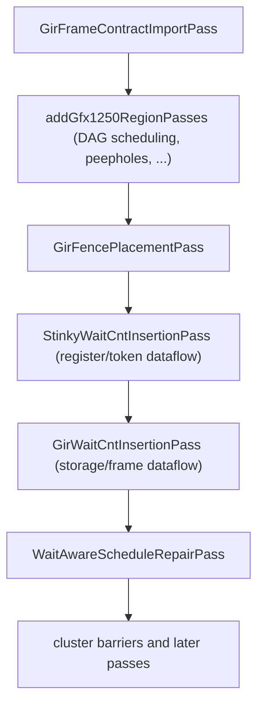

# GIR Frame Passes and Analyses

## Status

This document defines the GIR frame synchronization algorithms.

Two analyses and two GIR-owned passes turn the
[GIR frame contract](gir-frame-contract.md) into scheduling edges, workgroup
barriers and wait counts. The DAG scheduler consumes same-trip hazard edges, and
the generic wait pass contributes register waits that the GIR counter flow must
credit. StinkyTofu owns the final synchronization; the contract supplies
rotation and control-flow facts while instruction modifiers supply the accesses.

| Component | File |
| --- | --- |
| `GirFrameContractImportPass` | `src/transforms/asm/GirFrameContractImportPass.cpp` |
| `GirFrameAnalysis` | `src/analysis/asm/GirFrameAnalysis.cpp` |
| `GirFrameHazardAnalysis` | same file, `GirFrameHazardAnalysis::run` |
| Same-trip scheduling edges | `src/transforms/asm/dag/RegionDAG.cpp`, `addGirFrameHazardEdges` |
| `GirFencePlacementPass` | `src/transforms/asm/GirFencePlacementPass.cpp` |
| Generic register waits | `src/transforms/asm/StinkyWaitCntInsertionPass.cpp` |
| `GirWaitCntInsertionPass` | `src/transforms/asm/GirWaitCntInsertionPass.cpp` |
| Counter flow (the wait solver) | `src/transforms/asm/waitcnt/GirFrameCounterFlow.cpp` |

```cpp
STINKYTOFU_EXPORT std::unique_ptr<Pass> createGirFencePlacementPass();
STINKYTOFU_EXPORT std::unique_ptr<Pass> createGirWaitCntInsertionPass();
```

## Pipeline Position



`GirFrameContractImportPass` runs before ST region scheduling and only moves
data: it copies the module's contract onto each function as struct metadata, and
fails loudly if the pipeline is enabled with no contract or with no instruction
carrying an action tag. See
[How the contract reaches a function](gir-frame-contract.md#how-the-contract-reaches-a-function).

Fence placement runs before both wait passes. The generic wait pass then emits
register def-use waits, and the GIR wait pass runs last. The ordering invariants
are:

1. a fence must exist before its residual can be measured;
2. generic waits change the DS and tensor FIFO ranks; and
3. the GIR flow must see and credit that final incoming wait stream instead of
   deriving a count that an earlier generic wait immediately makes stale.

Neither GIR pass is gated on the scheduler. `GirFencePlacementPass` is the only
source of GIR workgroup barriers on this path, and the GIR wait pass anchors on
them at every optimisation level. When scheduling is enabled, however, the
scheduler also consumes the hazard analysis; see
[Scheduler integration](#scheduler-integration).

### Enabling

`Gfx1250Backend.cpp` runs fence placement and GIR wait insertion only when all
three `ModuleOptions` hold:

```cpp
moduleOptions.EnableWaitCntInsertion &&
moduleOptions.EnableGirFramePipeline &&
moduleOptions.EnableGirFrameWaitCntInsertion
```

`GirFrameContractImportPass` itself is gated only by
`EnableGirFramePipeline`. `StinkyWaitCntInsertionPass` is gated by
`EnableWaitCntInsertion` and runs whether or not GIR is enabled. A module with
the GIR frame pipeline off therefore still gets generic register waits, but no
GIR fence or storage wait.

Independently of the options, both passes return `PreservedAnalyses::all()`
immediately when `GirFrameAnalysis` or `GirFrameHazardAnalysis` is empty — no
contract means no work, not a fallback.

### Debugging

The counter-flow traces are `PASS_DEBUG` under
`DEBUG_TYPE "GirWaitCntInsertionPass"`, so they are enabled by adding that name
to `PassManagerDebugConfig::addDebugOnly`. For each accepted hazard the trace
reports counter, kind, cross-agent flag, gap, producer, consumer and chosen
anchor; then for each emitted anchor, the wait it settled on and the producers
that constrained it:

```text
[gir-haz] fn=temp counter=tensor kind=0 crossAgent=1 gap=0 prod=label_LoopBeginL#10/act19 ...
[gir-wait] fn=temp anchor=label_LoopBeginL#12 counter=tensor wait=0 <- label_LoopBeginL#1 ...
[gir-relax] anchor=label_LoopBeginL#18 counter=ds
```

`[gir-relax]` means a provisional site was proved unnecessary and removed. Only
finite decisions produce `[gir-wait]` records.
Materialized barrier waits carry comments such as
`GIR fence (RAW,WAR)` so the owning hazard kinds are visible in assembly.

`ST_GIR_SPAN_STATS=1` separately reports span walks that ended without either
reaching the anchor or retiring — see [Unaccounted spans](#unaccounted-spans).

---

## GirFrameAnalysis

Builds the **frame graph**: the finite unrolling of the CFG in which every
rotating buffer's phase is known.

### Contract ingestion

Production code receives a structured module contract through
`GirFrameContractImportPass`. Tests and hand-written STIR may instead attach
string metadata beginning with `gir-frame-contract`;
`parseGirFrameContract` parses `gen`, `incoming` and `requires` records. Actions
and accesses are not duplicated in that text: they are reconstructed from the
`GirActionData` on instructions. A malformed record, unknown tag or missing
marker is fatal.

A *frame* is an assignment of a phase to every generation. A *frame node* is a
`(BasicBlock, frame, incomingAction)` tuple. `incomingAction` preserves which
logical action reached an untagged block even when two paths have the same
phase. The analysis starts at the entry block with every phase 0 and propagates:

```cpp
const bool backEdge = to == loop->headerBB && loop->contains(from);
if (backEdge)          next.setPhase(genId, frame.phaseOf(genId) % gen.ring);
else if (to == header) next.setPhase(genId, gen.entry % gen.ring);

if (matchingIncoming) {
    int value = incoming.value;
    if (incoming.relative) value = (frame.phaseOf(genId) + value) % gen.ring;
    next.setPhase(genId, value);
}
```

Only an edge into the header applies the loop entry rule. Rotation itself comes
from a relative `incoming` record. The back-edge `setPhase` also ensures the
generation remains part of the frame's identity when its numeric phase is
unchanged.

### Mapping generations to loops

A generation must know which loop rotates it. An `incoming` destination gives
the exact containing loop when all matching records agree. Otherwise the
analysis votes: for every access naming that generation, it finds the containing
loop of each realizing instruction and takes the strict majority. Ambiguous
mapping, or a rotating generation with no loop at all, is fatal rather than a
default — see [Validation](gir-frame-contract.md#validation).

### Guard generations

`Requires` records let a correlated branch be modelled. `edgeFeasible` refuses an
edge whose destination requires a phase this frame does not hold. A guard whose
value is undecided satisfies every constraint, so kernels without correlated
branches are unaffected.

### Result

| Field | Meaning |
| --- | --- |
| `contract` | The parsed contract |
| `actionInstructions` | actionId to every instruction realizing it |
| `blockFrames` | Every frame reachable at a block |
| `edges` | Frame-node successor lists, including incoming-action identity |
| `occurrences` | Every `(instruction, access, frame)` with its storage id |
| `backEdges` | Latch-to-header edge keys |

State explosion is bounded by `kMaxFrameStates` (2^20).

### `lastBarrierBefore`

```cpp
std::pair<StinkyInstruction*, GirFrame> lastBarrierBefore(
    frames, block, frame, limit, alsoFences = {});
```

**The single definition of "a barrier stands here"**, shared by the pass that
places barriers and the pass that anchors waits on them. `alsoFences` lets a
caller that has decided on a fence but not yet materialised it ask the same
question of its own plan, rather than maintaining a second walk that can drift.

Three ordering rules live here:

- **A split all-wave barrier is one barrier, named by its signal.** Both halves
  of an `s_barrier_signal -1` / `s_barrier_wait -1` pair satisfy `isBarrier`, so
  returning the later one would place a drain *between* the halves — the wave
  would announce completion before its own writes had landed.
- **Predecessors are examined in program order.** `frames.edges` is hashed on
  the block address, so predecessor lists are explicitly sorted before choosing
  the nearest preceding fence.
- **A virtual marker at `limit` is already before that instruction.** A marker
  names the instruction that materialization will insert a barrier before, so
  `alsoFences` may match exactly at `limit`. An already materialized instruction
  at that index is not before itself.

---

## GirFrameHazardAnalysis

Turns occurrences into hazards by walking the frame graph and reporting every
pair that touches one storage id with at least one write.

```text
producer write, consumer read   -> RAW
producer write, consumer write  -> WAW
producer read,  consumer write  -> WAR
read/read                       -> not a hazard
```

`GirFrameHazard` carries both endpoints with their blocks, indices and frames,
plus:

- **`gap`** — frame-graph edges traversed between the two occurrences, not a
  generation delta. `0` means the pair executes in program order in one frame
  node; `>= 1` means another node was entered, which is a later trip only when
  both ends sit in the same loop block.
- **`crossAgent`** — whether other waves observe the access, which is what makes
  a hazard need a barrier rather than only a wait. It is true only when
  `NumWaves > 1` and at least one endpoint is marked cross-agent.

### Program-order gap versus logical generation distance

Ring reduction can make both of these examples name the same physical ring-2
slot:

```text
read  gdelta=0
write gdelta=2
```

If the read appears before the write in the block, no loop edge is crossed.
That is a same-trip WAR and its **program-order gap is 0**. The `+2` is only a
logical generation name reduced modulo the ring; it must not rewrite the
execution distance to 2. This remains true in a multi-wave kernel: a workgroup
barrier orders waves, but does not retire the issuing wave's outstanding
`ds_load`, so the local DS wait still anchors before the barrier.

The unreduced `gdelta` difference is used only when program order proves a wrap:
the producer and consumer are in one block, name the same relative generation,
and the producer's instruction index is at or after the consumer's. In that
case a positive `consumer.gdelta - producer.gdelta` recovers the logical span
lost by ring reduction. For example, a copy later in the body at `gdelta=0`
feeding a read earlier in the body at `gdelta=2` is loop-carried with `gap=2`.

### Additional hazard rules

**WAW suppressed by an intervening read.** `wawOrderedByRead` drops a WAW when
some read of the same storage already orders the two writes; the read's
ordering discharges that write/write relation.

**Single-wave accesses are not cross-agent.** Contract access flags describe
visibility, but a function with one wave cannot require inter-wave publication.
Its RAW, WAR and WAW hazards still receive scheduler edges and waits where
needed, but no workgroup barrier.

---

## Scheduler integration

`StinkyDAGSchedulerPass` obtains `GirFrameAnalysis` and
`GirFrameHazardAnalysis` before scheduling each region. After the ordinary
register DAG is built, `addGirFrameHazardEdges` turns every non-self
`gap == 0` frame hazard into an ordinary DAG edge:

```text
producer --same-trip RAW/WAR/WAW--> consumer
```

An edge means the consumer is not in the ready set until the producer has
issued. The ready queue may choose among other legal nodes, but it cannot invert
this pair. A pair split across scheduling regions is already ordered by region
sequence; an in-region edge that would form a cycle is a frame-model error.

The same integration chains all physical pieces of one GIR fence action in
their emitted order. `validateGirFrameHazardOrder` checks the incoming order and
the scheduled order, and the pass invalidates and rebuilds the hazard analysis
after scheduling. In GIR frame mode the scheduler does not use the legacy LDS
memory-token dependencies; the frame hazards are the ordering authority.

---

## GirFencePlacementPass

Decides where workgroup barriers go over **one unchanging program**. It returns
immediately if no hazard is cross-agent. Nothing touches the IR until the plan
is final, so no hazard index goes stale under an insertion and an undo costs a
set erase.

The plan is a `Markers` set of instructions a fence has been decided to precede.

### The frame CFG

`buildFrameCFG` numbers every `(block, frame)` node and records its predecessors.
Nodes are assigned in program order; a `(block, frame)` reachable only through
the edge set still gets a node, because dropping its edge for want of one is
what leaves a hazard undischarged.

### Mandatory RAW ownership

Before the general cut, `rawMarkers` gives each cross-agent RAW a latest
physical publication point. RAWs from the same logical producer action and
counter may share an earlier deadline only when that slot is legal for every
edge and no same-counter issue, existing wait or barrier lies between their
deadlines. This preserves each producer's FIFO rank.

These markers are ownership points, not ordinary hitting-set candidates. Moving
a RAW to an older barrier can shorten its in-flight interval and turn a graded
wait into an unnecessary drain.

### Phase 1 — cut

Least fixpoint of the may-reach set over producers with no fence crossed since.
The meet is **union**, so a producer unfenced on any incoming path is unfenced
here. A fence publishes everything, so its kill is total: tracking discharge
per-storage instead is what invents redundant fences, because each one then
looks like it covers only its own hazard.

While any hazard is violated, mark the slot with the deepest residual and
re-solve.

### Phase 2 — cover position

The fixpoint answers *liveness*; the wait pass asks *position* — does a barrier
stand before this consumer. For every cross-agent hazard with no barrier before
its consumer, mark the consumer. The query goes through `lastBarrierBefore` with
the plan as `alsoFences`, so both phases speak of the same fences.

### Phase 3 — shrink auxiliary cuts

Greedy placement overshoots. Drop each auxiliary WAR/WAW marker in turn and
keep it dropped if no violation reappears. Mandatory RAW ownership markers are
not candidates.

### Phase 3b — wait-aware ownership

The pass calls `buildGirFrameWaitPlan` against the still-virtual marker set. A
tensor RAW that produces no tensor wait publishes no new completion, so its RAW
ownership is removed. If that leaves a marker with no owned hazard kind, the
marker is retired and the cut, positional coverage, auxiliary shrink and wait
plan are closed again. A WAR/WAW path that merely happened to cross the retired
RAW marker therefore receives its own marker and counter wait. A retired marker
may not be selected again; doing so means fence placement and wait ownership
have no common fixpoint.

The final plan rejects a RAW-stamped marker without a tensor wait. It also
checks that two pure WAR barriers with no intervening tensor issue were not left
mergeable.

### Phase 4 — materialise

Only now does the plan become instructions. Each marker gets a signal/wait pair
inserted before it:

```asm
    s_barrier_signal -1
    s_barrier_wait -1        // GIR fence
```

The loaded frame contract disables the legacy token-absence fallback;
the frame counter flow supplies this barrier's waits.

The wait half also carries a diagnostic comment listing every kind the barrier
owns, for example:

```asm
    s_wait_dscnt 0
    s_barrier_signal -1
    s_barrier_wait -1        // GIR fence (WAR)
```

---

## GirWaitCntInsertionPass

Derives every wait from the frame graph. The pass itself is thin: it calls
`buildGirFrameWaitPlan` and emits the result.

### Counters

Only `CK_DS` and `CK_Tensor` are handled here. `counterFor` picks by hazard kind:
a RAW takes the producer's counter; otherwise a DS endpoint on either side makes
it DS, and everything else is tensor.

`waitToDrain(counter, n) = clampWaitCount(n - 1)` — if `n` same-counter issues
stand at or after the producer when control reaches the anchor, retiring the
producer means waiting until `n - 1` remain.

### Anchors

```cpp
StinkyInstruction* anchor = hazard.consumer;
if (hazard.crossAgent) std::tie(anchor, anchorFrame) = enclosingFence(...);
```

A same-wave hazard anchors on its consumer. A cross-agent hazard anchors on the
barrier that discharges it, resolved **by position** through `lastBarrierBefore`
rather than by any fence-to-hazard table, so a barrier StinkyTofu placed itself
anchors exactly like one it inherited. A cross-agent hazard with no barrier is a
fatal error.

For a split all-wave barrier, the anchor is its signal. A same-trip cross-agent
WAR therefore emits its `s_wait_dscnt` before the signal, not between signal and
wait and not after the barrier.

### Feasible trip domains

Before accepting a hazard or walking its span, the counter flow propagates
possible trip counts through recognized prefetch-control branches. It evaluates
literal scalar compares leading to labels containing `skipPGR`, `toPGR`,
`LoopEndL` or `NoGlobalLoadLoop`. An impossible short-prefetch path therefore
cannot lower the steady-loop FIFO rank. Unknown compares remain conservative:
their whole input domain is retained.

### The span walk

`walkSpan` counts how many same-counter issues stand at or after the producer
when control reaches the anchor. It walks the hazard's **own span** rather than
reading a per-node state, because a state keyed by `(instruction, frame)` cannot
hold an occurrence a full ring period back: with ring 2 the read two trips ago
and this trip's read are the same key, so the newer overwrites the older and the
lookup answers 1 for a producer a full loop of issues has since buried.

Three properties are deliberate:

- **State deduplication, not a budget.** The frame graph is a graph, so the same
  state is reachable many ways. Deduplicating the full state makes the walk
  finite and complete.
- **`perPred` takes the minimum over all paths through each predecessor**, not
  merely the predecessor of one globally cheapest path.
- **`count = -1` is not the same as "unaccounted".** See below.
- **The anchor must match at the hazard's exact span.** Seeing the same static
  barrier on an earlier frame step does not let a RAW bind to an unrelated
  publication point.
- **Existing waits retire entries.** `observedWaitDrains` decodes the opcode and
  literal operand (using modifiers only as a fallback), so waits inserted by the
  generic pass participate in the same simulation.

#### Unaccounted spans

A walk that reaches the anchor on no path proves the producer retired *only* if
every path got there by retiring. A path that ran out of span, or off the end of
the frame graph, was never modelled at all. The two must not share a return
value: treating "I could not model this" as "no constraint" is how a missing
wait becomes silent. `SpanResult::unaccounted` records it, and
`ST_GIR_SPAN_STATS=1` reports the count per function. It should be 0.

### Closing the decisions

`closeDecisions` reaches a fixpoint by **strengthening only**, from "no wait"
downwards. Both directions converge, but only this one reaches the weakest safe
assignment: seeding every anchor at 0 drains the queue at each anchor before the
queue is ever read, so a loop-carried producer is never in flight, its rank is
never observed, and 0 re-derives itself — self-consistent and maximally strong.
Seeding at `kUnused` leaves the pipeline at its real depth.

A final `simulate` re-checks every site; a decision weaker than the requirement
is a fatal error, never a pass.

### Removing and rejecting redundant waits

Strengthening closure can make a later provisional site unnecessary after an
earlier wait is chosen. The solver tries removing one site at a time, re-closes
the full decision system, and accepts the removal only if it and every earlier
accepted removal remain unused. Accepted removals produce `[gir-relax]` traces.

After materialization planning, a forward CFG dataflow computes the upper bound
already established for DS and tensor counters by existing waits and
intervening issues. A planned wait that is weaker than or equal to that bound
cannot change the counter and is a fatal counter-model defect
(`GIR counter flow produced redundant ...`), not an instruction silently kept
in the output.

### Promotions and tail drains

Where several predecessors reach one anchor with different requirements, the
anchor can take the *weakest* common wait and each cheaper edge gets a drain in
its predecessor's tail instead. `derivePromotions` does this only when the
predecessor is in the pass's covered region, has this block as its sole
successor, and no wait already stands in the anchor's prefix.

### Emission

```cpp
if (spec.dsCount     != kUnused) -> s_wait_dscnt <n>
if (spec.tensorCount != kUnused) -> s_wait_tensorcnt <n>   (+ MemTokenData)
```

Tail drains are emitted before the predecessor's terminator when that terminator
is a branch.

---

## Relationship to `StinkyWaitCntInsertionPass`

**Two passes insert waits and they answer different questions.** The frame walk
covers storage hazards named by the contract. The token dataflow in
`StinkyWaitCntInsertionPass` covers register def-use — for instance the `dscnt`
before a `v_wmma` that consumes a `ds_load`'s destination registers.

The generic pass runs first. The GIR pass credits its waits, then emits only the
additional storage ordering still required. Consequently:

- a `dscnt 0` before a WMMA, with no GIR WAR fence or overwrite there, is
  normally a generic register RAW wait;
- a same-trip GIR WAR can emit `dscnt 0` immediately before a same-wave
  `tensor_load`, or before the signal of a cross-agent GIR fence;
- a GIR WAR need not be zero: if newer DS issues may remain in flight, a graded
  `dscnt N` retires only the aliased reader; and
- absence of a finite `counter=ds` `[gir-wait]` record means the GIR pass emitted
  no DS wait at that anchor. Compare pass dumps immediately after
  `StinkyWaitCntInsertionPass` and `GirWaitCntInsertionPass` for definitive
  attribution.

## Related documents

- [GIR Frame Contract](gir-frame-contract.md) — the input
- [Insert Cluster Barrier Pass](cluster-barrier.md) — the `-3` barriers, a
  separate mechanism with its own placement rules
- [Wait-Aware Schedule Repair Pass](wait-aware-schedule-repair-pass.md) — runs
  after wait insertion and treats emitted waits as fixed
- [Architecture](architecture.md) — pass pipeline overview
